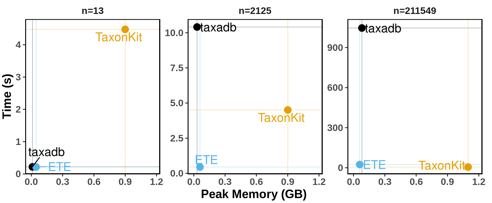

# Benchmark

## Data set

- [NCBI taxonomy](ftp://ftp.ncbi.nih.gov/taxonomy), version 2019-07-01

- taxids
    - small.txt (n=13)

            cut -f 1 nodes.dmp | csvtk sample -H -p 0.00001 > taxids.small.txt

    - medium.txt (n=2125)

            cut -f 1 nodes.dmp | csvtk sample -H -p 0.001 > taxids.medium.txt

    - big.txt (n=211549)

            cut -f 1 nodes.dmp | csvtk sample -H -p 0.1 > taxids.big.txt

## Softwares

- ETE, version: [3.1.1](https://pypi.org/project/ete3/3.1.1/)
- BioPython, version: [1.73](https://pypi.org/project/biopython/1.73/)
- taxadb, version: [0.10.1](https://pypi.org/project/taxadb/0.9.0)
- TaxonKit, version: [0.5.0](https://github.com/shenwei356/taxonkit/releases/tag/0.10.1)

## Installation and Configurations

- ETE

        sudo pip3 install ete3

- Biopython

        sudo pip3 install biopython

- taxadb

        sudo pip3 install -U taxadb
        taxadb download --type taxa -o ~/.taxadb -f
        taxadb create -i ~/.taxadb --division taxa  --dbname ~/.taxadb/taxadb.sqlite

## Scripts and Commands

Scripts/Command as listed below.
Python scripts were written followed to the official documents,
and parallelized querying were not used, including taxonkit.

    ETE             get_lineage.ete.py
    Biopython       get_lineage.biopython.py
    taxadb          get_lineage.taxadb.py
    taxonkit        taxonkit lineage -d "; "

A Python script [memusg](https://github.com/shenwei356/memusg) was used
to computate running time and peak memory usage of a process.
A Perl scripts
[`run.pl`](https://github.com/shenwei356/seqkit/blob/master/bench/run.pl)
is used to automatically running tests and generate data for plotting.

**Note that `get_lineage.biopython.py` is not used,
because quering via internet (entrez) is too slow for large number of queries.**

Running benchmark:

    # 55min for me...
    time perl run.pl -n 3 run_benchmark.sh -o bench.get_lineage.tsv

    # clear
    # rm *.lineage
    # rm *.out

Checking result:

    md5sum *.lineage
    f7a31ab739f896fade1cf0808c2f374c  taxids.big.txt.ete.lineage
    f7a31ab739f896fade1cf0808c2f374c  taxids.big.txt.taxadb.lineage
    25947a23dd76e236c3740e0403c4050a  taxids.big.txt.taxonkit.lineage
    0704aa45fe5e4bfb16491820cb3bf6bf  taxids.medium.txt.ete.lineage
    0704aa45fe5e4bfb16491820cb3bf6bf  taxids.medium.txt.taxadb.lineage
    0704aa45fe5e4bfb16491820cb3bf6bf  taxids.medium.txt.taxonkit.lineage
    7fa77b023f69d3b5dfa45be88b624799  taxids.small.txt.ete.lineage
    7fa77b023f69d3b5dfa45be88b624799  taxids.small.txt.taxadb.lineage
    7fa77b023f69d3b5dfa45be88b624799  taxids.small.txt.taxonkit.lineage

    diff taxids.big.txt.ete.lineage taxids.big.txt.taxonkit.lineage
    1c1
    < 1
    ---
    > 1     root

The only difference in `taxids.big.txt.taxonkit.lineage` is
taxonkit returns "root" for taxid 1, while the others return nothing.

Plotting benchmark result. 
R libraries `dplyr`, `ggplot2`, `scales`, `ggthemes`, `ggrepel` are needed.

    # reformat dataset
    # tools: https://github.com/shenwei356/csvtk/
    for f in taxids.*.txt;  do wc -l $f; done \
        | csvtk space2tab | csvtk cut -H -t -f 2,1 \
        | csvtk replace -H -t -f 2 -p ^ -r n= \
        > dataset_rename.tsv

    cat bench.get_lineage.tsv \
        | csvtk replace -t -f dataset -k dataset_rename.tsv -p '(.+)' -r '{kv}' \
        | csvtk sort -t -k dataset:N \
        > bench.get_lineage.reformat.tsv

    ./plot.R -i bench.get_lineage.reformat.tsv --width 8 --height 3.3

Result

<noscript>Please enable JavaScript to view the <a href="https://disqus.com/?ref_noscript">comments powered by Disqus.</a></noscript>

